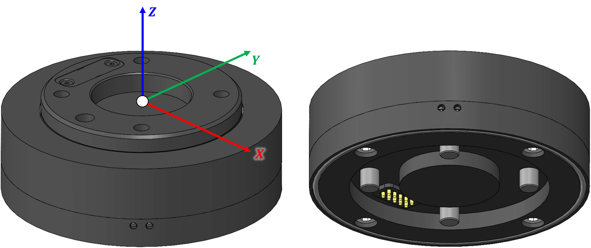

# AFT_RBY2-C — Communication Manual

Rev. 2026.08.27 · MCU FDCAN2 · Classic CAN 2.0 (1 Mbit) / CAN-FD

> 같은 내용을 꾸민 HTML 버전: [`AFT_RBY2_CAN_Protocol.html`](AFT_RBY2_CAN_Protocol.html) (다운받아 브라우저로 열기)

AFT_RBY2-C 6축 힘/토크(F/T) 센서의 CAN 통신 프로토콜 문서입니다. 아래 표에 없는 명령/필드는
존재하지 않습니다 — 펌웨어 소스(`app_freertos.c`, `fdcan.c`, `main.h`) 전수 대조로 작성했습니다.

## 목차

- [0. 좌표계 (Coordinate Frame)](#0-좌표계-coordinate-frame)
- [1. 통신](#1-통신)
  - [1.1 CAN 사양](#11-can-사양)
  - [1.2 Mode Setting](#12-mode-setting)
  - [1.3 Force & Torque Data 변환](#13-force--torque-data-변환)
  - [1.4 Special Command](#14-special-command)
- [2. 주의사항](#2-주의사항)

## 0. 좌표계 (Coordinate Frame)



센서 원점(O)은 상판 중심, 좌측 도면 기준 **X(적색)·Y(녹색)·Z(청색)**. CAN으로 나오는
Fx/Fy/Fz, Tx/Ty/Tz는 전부 이 좌표계 기준입니다. 우측은 하단 커넥터 핀 배치 참고용입니다.

## 1. 통신

### 1.1 CAN 사양

| 항목 | 값 |
|---|---|
| 인터페이스 | FDCAN2, 표준 ID(11bit) |
| 비트레이트 | 클래식 CAN 1 Mbit, CAN-FD nominal 1M / data 최대 4M(FDSETTING 값에 따라 다름) |
| 명령 수신 ID (Rx) | `0x220`(CAN 2.0) / `0x320`(CAN FD) |
| 측정 송신 기본 ID (Tx) | `0x230`(CAN 2.0, `can20ID`) / `0x330`(CAN FD, `canFDID`) |
| 부트로더 UDS ID | `0x7A0`(요청) / `0x7A8`(응답) — 별도 CAN IAP 부트로더 문서 참고 |

### 1.2 Mode Setting

명령 프레임은 8바이트, **Data[0]/Data[1]은 항상 "현재 센서 TX CAN ID"(LSB/MSB)** 여야 명령이
받아들여집니다(불일치 시 무시). 아래 표의 `RX CAN ID`로 프레임을 보냅니다.

| RX CAN ID | Data[0] | Data[1] | Data[2] | Data[3] | Data[4] | Data[5] | Description |
|---|---|---|---|---|---|---|---|
| `0x220` `0x320` | current TX CAN ID (LSB) | current TX CAN ID (MSB) | `0x01` | `0x01`(CAN2.0 ID) / `0x02`(CAN FD ID) | 새 ID (LSB) | 새 ID (MSB) | **Sensor TX CAN ID Setting** — 0x7FF 초과 시 기본값(0x230/0x330)으로 복귀 |
| `0x220` `0x320` | current TX CAN ID (LSB) | current TX CAN ID (MSB) | `0x02` | — | — | — | **Bias (Zero Setting)** |
| `0x220` `0x320` | current TX CAN ID (LSB) | current TX CAN ID (MSB) | `0x03` | `0x01`~`0x06` | — | — | **Transmitting Data** — 6가지 모드, [1.3](#13-force--torque-data-변환) 참조 |
| `0x220` `0x320` | current TX CAN ID (LSB) | current TX CAN ID (MSB) | `0x04` | `0x01`(CAN2.0) / `0x02`(CAN FD) / `0x03`(CAN FD BRS) | — | — | **CAN Mode Setting** — 전환 시 전송 멈춤(재전송 시작 명령 별도 필요) |
| `0x220` `0x320` | current TX CAN ID (LSB) | current TX CAN ID (MSB) | `0x05` | `0x01`(100Hz) / `0x02`(250Hz) / `0x03`(500Hz) / `0x04`(1000Hz) | — | — | **Sample rate setting** |
| `0x220` `0x320` | current TX CAN ID (LSB) | current TX CAN ID (MSB) | `0x06` | `0x01`~`0x04` (FD 비트타이밍 프리셋) | — | — | **FD Parameter setting** — ⚠ 재부팅 후 반영, [2장](#2-주의사항) 참조 |
| `0x220` `0x320` | current TX CAN ID (LSB) | current TX CAN ID (MSB) | `0x09` | `0x01`(OFF) / `0x02`(ON) | — | — | **IMU Additional Frame** *(신규, IMU_MPUXX50 빌드에서만)* — [1.3.5](#135-imu-additional-frame-신규) 참조 |

> `0x07`(CLEARERROR), `0x08`(GETSTATUS)는 상수만 정의돼 있고 실제 처리 코드가 없습니다 — 보내도 무시됩니다.

#### 1.2.1 Transmitting Data 옵션 (Data[3], SID=0x03)

| Data[3] | 이름 | 내용 |
|---|---|---|
| `0x01` | INT, 온도보상 없음 | [1.3.1](#131-int-transmitting-mode) |
| `0x02` | INT, 온도보상 포함 | [1.3.1](#131-int-transmitting-mode) |
| `0x03` | INT Combined, 온도보상 없음 (FD 전용) | [1.3.3](#133-int-combined-transmitting-mode-fd-only) |
| `0x04` | INT Combined, 온도보상 포함 (FD 전용) | [1.3.3](#133-int-combined-transmitting-mode-fd-only) |
| `0x05` | Float Combined, 온도보상 없음 (FD 전용) | [1.3.4](#134-float-combined-transmitting-mode-fd-only) |
| `0x06` | Float Combined, 온도보상 포함 (FD 전용) | [1.3.4](#134-float-combined-transmitting-mode-fd-only) |

### 1.3 Force & Torque Data 변환

모든 데이터는 **little-endian**(LSB 먼저)입니다.

#### 1.3.1 INT Transmitting Mode

| TX CAN ID | DLC | data[0~5] | Description |
|---|---|---|---|
| `can20ID`+0 / `canFDID`+0 | 6 (ERRPKT ON 시 8) | Fx(2B) · Fy(2B) · Fz(2B) | 힘 3축, int16 |

계산식: `Force[N] = raw_int16 / 100`

#### 1.3.2 Torque INT Transmitting Mode

| TX CAN ID | DLC | data[0~5] | Description |
|---|---|---|---|
| `can20ID`+1 / `canFDID`+1 | 6 (ERRPKT ON 시 8) | Tx(2B) · Ty(2B) · Tz(2B) | 토크 3축, int16 |

계산식: `Torque[Nm] = raw_int16 / 1000`

#### 1.3.3 INT Combined Transmitting Mode (FD only)

| TX CAN ID | DLC | data[0~11] | Description |
|---|---|---|---|
| `canFDID`+2 | 12 (ERRPKT ON 시 16) | Fx·Fy·Fz·Tx·Ty·Tz (각 2B) | 6축 한 프레임 |

계산식은 1.3.1/1.3.2와 동일(Force/100, Torque/1000). ERRPKT ON 시 `data[12~13]`에 에러워드 2B 추가(DLC16).

#### 1.3.4 Float Combined Transmitting Mode (FD only)

| TX CAN ID | DLC | data[0~23] | Description |
|---|---|---|---|
| `canFDID`+2 | 24 (ERRPKT ON 시 32) | Fx·Fy·Fz·Tx·Ty·Tz (각 4B, IEEE754 float32) | 6축 한 프레임, 물리값 그대로(스케일 없음) |

호스트에서 4바이트(little-endian)를 float로 복원:

```c
float ReadFloatLE(const uint8_t *p)
{
    uint32_t u = (uint32_t)p[0] | ((uint32_t)p[1] << 8) |
                 ((uint32_t)p[2] << 16) | ((uint32_t)p[3] << 24);
    float f;
    memcpy(&f, &u, sizeof(f));
    return f;   /* Fx = ReadFloatLE(&data[0]); Fy = ReadFloatLE(&data[4]); ... */
}
```

ERRPKT ON 시 `data[24~25]`에 에러워드 2B 추가(DLC32).

#### 1.3.5 IMU Additional Frame (신규)

`IMU_MPUXX50` 빌드 토글이 켜져 있을 때만 존재합니다(현재 기본 `DISable`). [Mode Setting](#12-mode-setting)의
`0x09` 명령으로 켜고 끄며, 켜면 현재 선택된 F/T 데이터타입과 무관하게 매 전송주기마다 아래 2프레임이
추가로 나갑니다. MPU-9250(I2C1)의 raw 값을 물리단위 환산 없이 그대로 싣습니다.

| TX CAN ID | DLC | data[0~5] | Description |
|---|---|---|---|
| `can20ID`+3 / `canFDID`+3 | 8 | AccelX(2B) · AccelY(2B) · AccelZ(2B) · 패딩(2B) | 가속도, raw int16 |
| `can20ID`+4 / `canFDID`+4 | 8 | GyroX(2B) · GyroY(2B) · GyroZ(2B) · 패딩(2B) | 자이로, raw int16 |

스케일(`MPUXX50_Init()` 고정 레인지 기준): 가속도 ±16g = 2048 LSB/g, 자이로 ±2000dps = 16.4 LSB/(deg/s).

### 1.4 Special Command

Data[0]/[1]이 TX CAN ID가 아니라 **고정 매직 바이트**인 명령들로, ID 일치 검사 없이 별도로 처리됩니다.

| RX CAN ID | Data[0] | Data[1] | Data[2] | Data[3] | Description |
|---|---|---|---|---|---|
| `0x220` `0x320` | `0xFF` | `0xFE` | `0xFD` | — | **Factory Reset** — 설정 전체를 flash 기본값으로 초기화 |
| `0x220` `0x320` | `0xFF` | `0xFE` | `0xFC` | `0x01`(CAN2.0) / `0x02`(CAN FD) | **Confirm ID** — 지정 모드의 실제 TX ID로 빈 프레임(DLC0) 응답 |
| `0x220` `0x320` | `0xFF` | `0xFE` | `0xFA` | `0x01`(ON) / `0x02`(OFF) | **Error Packet On/Off** — flash 저장. `ERRPKT_ENABLE` 빌드에서만 의미있음 |
| `0x220` `0x320` | `0xFF` | `0xFE` | `0xFB` | `0x5A` | **Enter Bootloader** — CAN IAP 부트로더 진입(핸드셰이크 후 리셋). `USE_BOOTLOADER` 빌드에서만 |
| `0x220` `0x320` | `0xF1` | `0xF2` | `0xF3` ... | `0xF4 0xFC 0xFD 0xFE 0xFF`(총 8바이트 매직) | **Log Dump** — 전송 멈추고 저장된 로그 전량 CAN 덤프 |

## 2. 주의사항

> **FD Parameter Setting(`0x06`)은 즉시 반영되지 않습니다.**
> 명령을 받으면 값만 저장하고, 실제 FDCAN 재설정 호출은 현재 코드에서 비활성화돼 있습니다.
> **다음 재부팅 시** 저장된 값이 한 번 적용되는 구조입니다 — 런타임에 바로 타이밍이 바뀌길
> 기대하면 안 됩니다.

> **`0x07`(CLEARERROR) / `0x08`(GETSTATUS)는 이름만 있고 미구현입니다.**
> 상수 정의와 주석만 있고 대응하는 처리 코드가 없어 보내도 무시됩니다. 에러패킷 기능
> (`ERRPKT_ENABLE`, 현재 `DISable`)이 켜지면서 같이 구현될 예정으로 추정 — 실사용 전 확인 필수.

이 문서는 2026-08-27 기준 펌웨어 소스 전수 대조로 작성했습니다. 코드가 바뀌면 이 문서도 같이
갱신해야 합니다.
